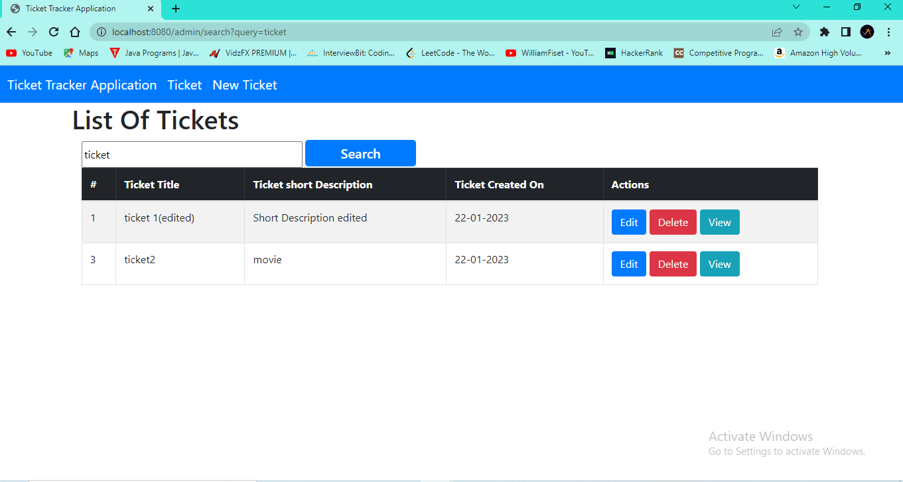

# Ticket Tracker Application

## Project Description

Ticket Tracker Application is web based App made of using Java, with MVC Architecture style (Spring Boot) , Thymeleafe(view engine), MySQL Database.This Application basically track Tickets input from user. This project able to perform CRUDS operations, including form to let user create and submit ticket informations and users data will be saved in Database. There is a table that display information of tickets saved in database. And contains Buttons for Edit, Delete, view so that user can make changes in its ticket by clicking edit button, delete data permanently from database by clicking delete button, and can view information of particular user data by clicking on view button. On the top there is a search section here user can search Ticket information by Typing its Title in input box by clicking on search button.

## Technology Used:

### Back-end:
- JAVA:- Java is a popular programming language, It is used for Mobile applications, Desktop applications, Web applications,Web servers and application servers,Games,Database connection etc.It is open-source and free, secure, fast and powerful.Java is an object oriented language which gives a clear structure to programs and allows code to be reused with lowering development costs.
- MySQL Database:- MySQL is a popular open-source database management system. used for storing and organizing data. It is known for its fast performance, reliability, and ease of use, based on the Structured Query Language (SQL).used to create and modify databases, tables, and other database objects.
- Thymeleaf:- Thymeleaf is a Java-based library used to create a web application. It provides a good support for serving a XHTML/HTML5 in web applications. 
- Spring Boot- Spring Boot is an open source Java-based framework used to create a micro-Service. It is developed by Pivotal Team and is used to build stand-alone and production ready spring applications.
- MVC:-We used Model,View,Controller Architectural Style.
- JPA:-JPA stands for Java Persistence API (Application Programming Interface).It is a Java specification that gives some functionality and standard to ORM tools. It is used to examine, control, and persist data between Java objects and relational databases.
- MAVEN:-Maven is a popular open-source build tool developed by the Apache Group to build, publish, and deploy several projects at once for better project management.
### Front-end
- HTML:- The HyperText Markup Language or HTML is the standard markup language for documents designed to be displayed in a web browser.
- CSS:- CSS stands for Cascading Style Sheets , describes how HTML elements are to be displayed on screen, paper, or in other media
- JavaScript:- JavaScript is a dynamic computer programming language. It is lightweight and most commonly used as a part of web pages, whose implementations allow client-side script to interact with the user and make dynamic pages. It is an interpreted programming language with object-oriented capabilities.
- Bootstrap:- Bootstrap is the most popular CSS Framework for developing responsive and mobile-first websites.

## Database:

- In this project whatever data is submited by user it get save in MYSQL Database. and user also retrive data from the database.

## What I've Learnt : 
- How to Make webApp in SpringToolSuite4/Eclips IDE.
- How to use MVC style .
- How the Maven tool provides allows developers to build and document the lifecycle framework.
- How to use JPA .
- How to use Spring-boot Framework. 
- How to use @query for search purpose.
- How to use text editor in Text-area.
- How to retrieve data from MySQl without HTML tag.
- How to retrieve date from MySQl in dd-mm-yyyy form and auto submit updated date .
- How to use Thymeleaf Template and rendered value.
- How to perform CRUDS operations.

## Getting start with this application

- Choose any IDE like Eclips, STS etc.
- Choose Work- space.
- Create project Name .
- Add Required Dependencies(Thymeleafe,JPA,Spring-Web,Mysql connector,etc) .
- Create Connection with data-base .
- Create server.servlet.context-path.
- Create spring.datasource.url.
- Create spring.jpa.properties.hibernate.jdbc.time_zone = UTC
- Create spring.datasource.username.
- Create spring.datasource.password.
- Create spring.jpa.properties.dialect.hibernate=org.hibernate.dialect.MySQL8Dialect
- Create spring.jpa.hibernate.ddl-auto=update
- Create spring.jpa.properties..hibernate.show_sql=true
- Create spring.jpa.properties..hibernate.formate_sql=true
- Create Entity ,repository,service,serviceImpl,Controller Package and write code for all.
- Create View template along with Controller and perform CRUDS operations.

### HOME- Page

Home Screen

### CREATE NEW TICKET- Page

Create New Ticket Screen

### SEARCH- Page

Search Screen

### EDIT- Page

Edit Screen

Edited Screen

Saved Screen

### DELETE- Page

Delete Screen

### VIEW- Page

View Screen
